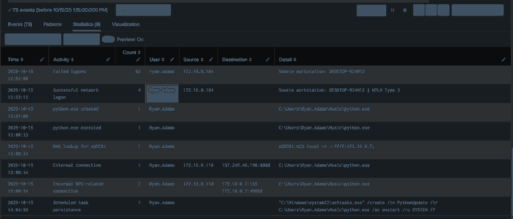

# Splunk 101 Capstone - SOC Incident Investigation


A hands-on Splunk capstone demonstrating an evidence-driven SOC investigation across Windows endpoint and network telemetry.

## Project Overview

> Investigated a simulated intrusion using Splunk and correlated Windows Security, Sysmon, Zeek, Suricata, and Windows Application telemetry. Identified suspicious authentication activity, creation and execution of `python.exe`, process-attributed external communication, DNS/RPC activity involving the domain controller, and scheduled-task persistence. Delivered a final incident timeline and SOC report demonstrating end-to-end analysis, scoping, and reporting.

**Investigation flow**

`Authentication anomaly -> File creation -> Process execution -> External communication -> AD/DC interaction -> Persistence -> Scoping -> Report`

> **Evidence boundary:** the available telemetry does **not** establish brute-force RDP, encoded PowerShell, successful lateral movement, or sustained C2 beaconing. The project intentionally separates observed facts from analyst assessment.

## Repository Structure

```text
Splunk101-Capstone/
|
|-- README.md
|-- capstone_report.pdf
|-- spl_queries.txt
`-- screenshots/
    |-- failed_logons_dashboard.png
    |-- malicious_execution_query.png
    `-- incident_timeline.png
```

## Investigation Highlights

| Stage | Evidence |
|---|---|
| Authentication | 62 failed Event ID 4625 records for `ryan.adams` from `172.16.0.184` / `DESKTOP-924H12`, followed by Event ID 4624 Type 3 network logon activity |
| File creation | `C:\\Users\\Ryan.Adams\\Music\\python.exe` created at approximately 12:57:00 UTC |
| Execution | `python.exe` executed at approximately 13:00:33 UTC with `explorer.exe` as parent |
| External communication | `python.exe` connected from `172.16.0.110` to `157.245.46.190:8888` |
| Network corroboration | Zeek observed an established TLSv1.3 session to `157.245.46.190:8888` |
| Domain-controller activity | `python.exe` resolved `ADDC01.KCD.local` to `172.16.0.7` and made RPC-related connections to TCP/135 and TCP/49669 |
| Persistence | PowerShell launched `schtasks.exe` to create `PythonUpdate`, configured to run `python.exe` at startup as `SYSTEM` |
| Defender correlation | Windows Application telemetry reported `SECURITY_PRODUCT_STATE_SNOOZED`; causation was not proven |

## Evidence Screenshots

### 1. Failed Logons Dashboard

This visualization highlights concentrated failed authentication activity from one source workstation across multiple accounts, including Ryan Adams.


### 2. Suspicious Execution Query

Sysmon process creation evidence shows the suspicious executable and the scheduled-task persistence command.


### 3. Incident Timeline

A curated timeline correlates authentication, file creation, execution, DNS, external/internal network activity, and persistence while removing duplicate raw events.



## Key SPL Searches

The full reusable query set is in [`spl_queries.txt`](spl_queries.txt).

Core investigation workflow:

```text
Question
  |
Discover available telemetry / EventCodes
  |
Investigate
  |
Find artifact
  |
Pivot
  |
Correlate with another source
  |
Scope
  |
Separate FACT / ASSESSMENT / UNKNOWN
  |
Report
```

## Key Skills Demonstrated

- Built and refined SPL searches for authentication, process, file, DNS, and network telemetry.
- Correlated endpoint and network evidence across Windows Security, Sysmon, Zeek, Suricata, and Application logs.
- Attributed suspicious network activity to a specific process instead of relying only on IP-level correlation.
- Pivoted from a suspicious file to execution, external communication, domain-controller interaction, and persistence.
- Reduced noisy duplicate events into a concise investigation timeline.
- Scoped IOCs across the available environment.
- Distinguished confirmed evidence from assumptions and unknowns.
- Produced a final SOC report with containment, eradication, investigation, and monitoring recommendations.

## Key Takeaway for Graduates

When describing this work in a resume or interview:

- Lead with **action verbs**: *built, correlated, detected, investigated, visualized, scoped, reported*.
- Emphasize **hands-on skills** and **attack-to-defense correlation**, not only course theory.
- Showcase the **capstone investigation** as tangible proof of SOC capability.
- Explain what you **proved**, what you **assessed**, and what remained **unknown**.

A concise resume-ready description:

> Investigated a simulated endpoint compromise in Splunk by correlating Windows Security, Sysmon, Zeek, Suricata, and Application telemetry; identified suspicious authentication, malware-like execution, external communication, domain-controller-related activity, and scheduled-task persistence; scoped the incident and delivered an evidence-based SOC report.

## Report

See the final written report: [`capstone_report.pdf`](capstone_report.pdf)

---

**Author:** Nguyen Thai Hoang  
**Portfolio focus:** SOC Analyst / Cybersecurity Analyst
