# Splunk 101 Capstone: Ryan Adams Incident Investigation


**From a report of unexpected mouse movement to an evidence-based SOC report.** This lab walkthrough follows the analyst's questions, SPL searches, findings, and next pivots across Windows and network telemetry.

The investigation identified suspicious authentication, execution of `python.exe` from a user's Music folder, process-attributed external communication, internal DNS/RPC activity, and scheduled-task persistence. The external endpoint is assessed as suspected command and control (C2); successful lateral movement and the cause of a later Defender state change remain unconfirmed.

**Author:** Nguyen Thai Hoang  
**Environment:** Splunk training lab / simulated incident  
**Evidence source:** `Splunk_Capstone_Ryan_Adams_Journey_Tutorial_With_Final_Report.docx`

All 22 investigation images below were extracted directly from the supplied DOCX. Their original pixels and annotations are preserved. Figure numbers match the embedded image numbers; some additional views are expandable. Open any image for its full-resolution version.

## Contents

- [Scenario](#scenario)
- [Investigation setup](#investigation-setup)
- [Step-by-step investigation](#step-by-step-investigation)
- [Incident timeline](#incident-timeline)
- [Indicators and affected assets](#indicators-and-affected-assets)
- [Facts, assessments, and unknowns](#facts-assessments-and-unknowns)
- [Final SOC investigation report](#final-soc-investigation-report)
- [Reusable investigation workflow](#reusable-investigation-workflow)

## Scenario

Ryan Adams, a local administrator at a small dental clinic, contacted the **MahCyberDefense SOC** hotline after suspecting his computer had been compromised. Around **October 15, 2025 at 13:00 UTC**, his mouse was moving unexpectedly.

As the SOC analyst, investigate the available Splunk data, determine what occurred, identify indicators of compromise, establish the observable scope, and document findings and response recommendations.

The mouse movement is the reported symptom. The logs below establish suspicious activity around that time; they do not identify a specific remote-control session responsible for the movement.

## Investigation setup

### Time windows

All incident times in this walkthrough are **UTC on October 15, 2025**. Set the Splunk user's timezone to UTC before using these date-string searches or comparing displayed timestamps.

| Window | UTC interval | Purpose |
|---|---|---|
| A: core investigation | 12:45–13:15 | Authentication, processes, files, DNS, network, persistence, and Application events |
| B: immediate follow-up | 13:15–14:00 | Search for continued references to the external IP and exact executable path |
| Dataset-wide | `earliest=0` with All time selected | Inventory and intentionally expanded artifact scope |

Some original screenshots show **All time** in the picker while the SPL itself contains `earliest` and `latest`. Read both the search text and the result timestamps. Figures 2, 4, and 6 contain earlier all-time searches; Figure 15 uses an end time of 13:30. The copyable core queries below consistently use Window A. These original images are retained as evidence of the investigation, not presented as screenshots of newly executed searches.

### Search discipline

1. Ask a concrete question before choosing an EventCode.
2. Inventory the source and inspect a raw event to confirm its meaning and field names.
3. Follow observed artifacts: account, host, process path, IP, PID, and preferably `ProcessGuid`.
4. Cross-check endpoint findings against an independent network source.
5. State what the evidence proves and what still needs investigation.

The queries use the field names in the supplied lab, including `ComputerName` in Security logs and `Computer` in some Sysmon searches. `ProcessId` and `ProcessID` both appear in the source material; verify the actual extraction in your environment if a column is empty. Likewise, a `stats ... by` result can omit events with missing grouping fields: its table count need not equal the raw event count.

**Reproduction limit:** this repository documents the supplied investigation. The raw dataset and a live Splunk instance are not included, so the searches have not been rerun as part of this README rewrite. Added discovery and follow-up searches are labeled accordingly.

## Step-by-step investigation

### 1. Inventory the available telemetry

**Question:** What data can answer the incident questions?

Select **All time** for this inventory search.

```spl
index="mydfir-soc"
| stats count by sourcetype
| sort - count
```

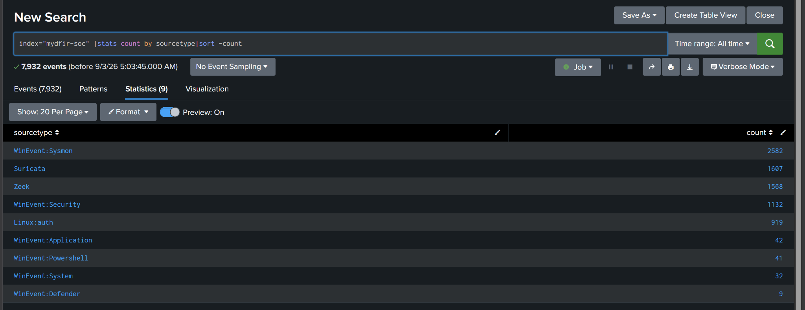

*Figure 1. Dataset inventory showing Windows, Zeek, Suricata, and Linux telemetry.*

**Finding:** the dataset includes `WinEvent:Sysmon`, `WinEvent:Security`, `WinEvent:Application`, `WinEvent:PowerShell`, Zeek, and Suricata, alongside other sources.

**Why it matters:** Windows logs can identify accounts and processes. Zeek and Suricata can independently corroborate network activity. A source's presence does not make every event relevant to Ryan.

**Next pivot:** inspect Windows Security events for Ryan during Window A.

### 2. Discover Security EventCodes before filtering

**Question:** Which authentication event types are present for Ryan?

This discovery query is provided in the DOCX; no separate results screenshot is supplied.

```spl
index="mydfir-soc" sourcetype="WinEvent:Security"
earliest="10/15/2025:12:45:00" latest="10/15/2025:13:15:00"
user="ryan.adams"
| stats count by EventCode
| sort EventCode
```

Inspect representative raw events before selecting codes. In this investigation, **4625** describes a failed logon and **4624** a successful logon.

### 3. Investigate repeated failed logons

**Question:** Is there a suspicious authentication pattern around the reported incident?

```spl
index="mydfir-soc" sourcetype="WinEvent:Security"
earliest="10/15/2025:12:45:00" latest="10/15/2025:13:15:00"
user="ryan.adams" EventCode=4625
| stats count by _time user ComputerName src_ip Logon_Type
| sort 0 _time
```

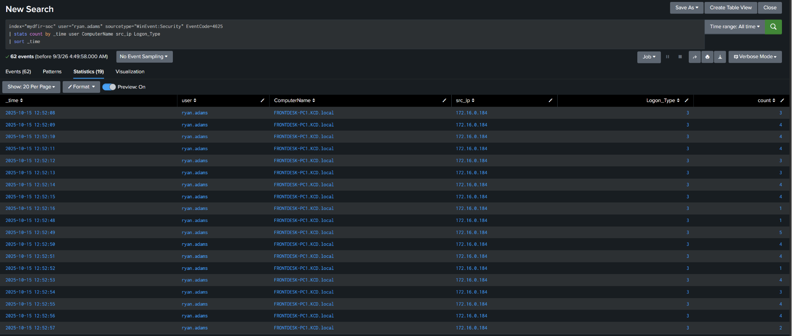

*Figure 2. Original all-time failed-logon view: repeated Type 3 failures for Ryan from 172.16.0.184.*

**Finding:** repeated failures begin around **12:52:08**, involving Ryan, `FRONTDESK-PC1.KCD.local`, source IP `172.16.0.184`, and Logon Type 3.

**Interpretation:** this supports a credential-guessing pattern. It does not yet distinguish a single-account brute-force attempt from a broader credential attack.

**Next pivot:** look for successful logons from the same source to the same account and destination.

### 4. Correlate successful logons

```spl
index="mydfir-soc" sourcetype="WinEvent:Security"
earliest="10/15/2025:12:45:00" latest="10/15/2025:13:15:00"
user="ryan.adams" EventCode=4624
| stats count by _time user ComputerName src_ip Logon_Type
| sort 0 _time
```

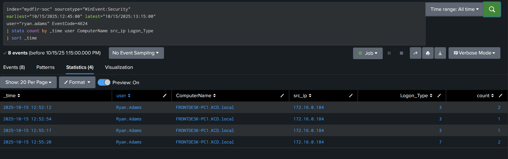

*Figure 3. Window A successful-logon results, including Type 3 network logons and a Type 7 unlock.*

**Finding:** successful Type 3 logons from `172.16.0.184` appear at **12:52:12**, **12:52:54**, and **12:55:17**. A separate Type 7 record appears at **12:55:20**.

| Logon type | Meaning | Interpretation here |
|---|---|---|
| 3 | Network logon | Successful network authentication using Ryan's credentials |
| 7 | Unlock | An unlock event; interpret separately from network logons |

**Evidence boundary:** failures precede the first success, and failures and successes overlap in the broader sequence. This supports suspected unauthorized credential use. It does not establish RDP or an interactive attacker desktop session.

<details>
<summary>Earlier all-time successful-logon view from the original journey.</summary>

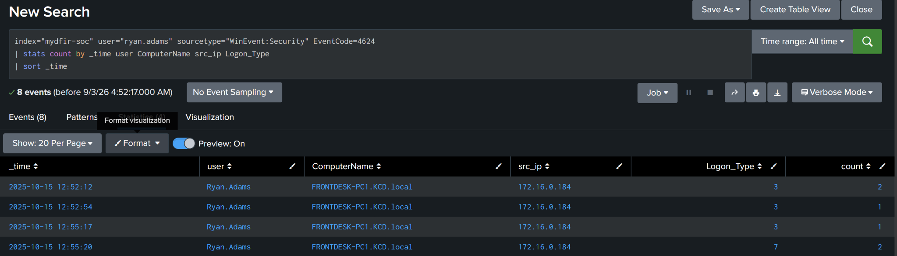

*Figure 4. Earlier all-time successful-logon view from the original journey.*

</details>

### 5. Pivot on the authentication source

**Question:** Did `172.16.0.184` target only Ryan, and can we identify that source host?

```spl
index="mydfir-soc" sourcetype="WinEvent:Security"
earliest="10/15/2025:12:45:00" latest="10/15/2025:13:15:00"
src_ip="172.16.0.184"
| stats count by user EventCode Logon_Type
| sort - count
```

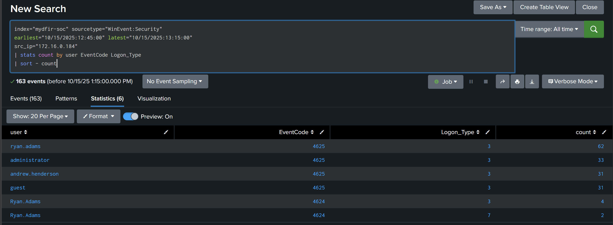

*Figure 5. Window A source-IP pivot showing failed authentication across multiple usernames.*

The displayed grouped results include:

| Account | EventCode | Logon type | Displayed count |
|---|---|---|---|
| `ryan.adams` | 4625 | 3 | 62 |
| `administrator` | 4625 | 3 | 33 |
| `andrew.henderson` | 4625 | 3 | 31 |
| `guest` | 4625 | 3 | 31 |
| `Ryan.Adams` | 4624 | 3 | 4 |
| `Ryan.Adams` | 4624 | 7 | 2 |

These are grouped event counts, not counts of unique passwords, attacker sessions, or people. Account capitalization is preserved from the displayed results.

**Assessment:** a credential attack affected multiple usernames. Password spraying is a possibility, but this table does not reveal which passwords were tried.

For historical context, deliberately widen the search to the full dataset:

```spl
index="mydfir-soc" earliest=0 "172.16.0.184"
| stats count by host sourcetype ComputerName user
```

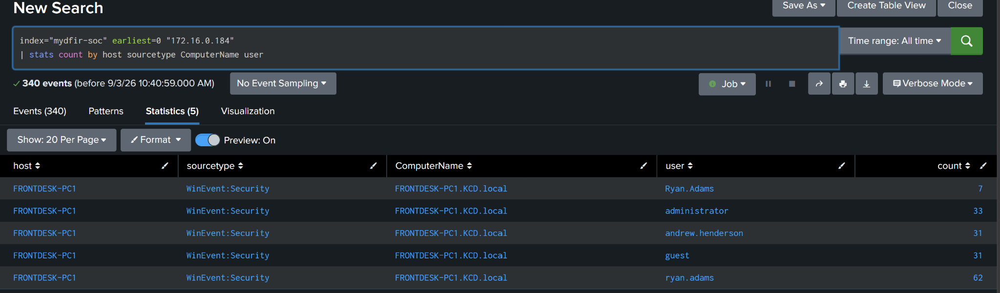

*Figure 6. All-time context: Security events recorded on FRONTDESK-PC1 reference the source IP and multiple accounts.*

**Evidence boundary:** `host=FRONTDESK-PC1` identifies the system supplying these logs. It does not map the authentication source IP to a hostname. The hostname and owner of `172.16.0.184` remain **unknown**.

### 6. Discover the available Sysmon event types

**Question:** Which endpoint events can explain activity around 13:00?

```spl
index="mydfir-soc" sourcetype="WinEvent:Sysmon"
earliest="10/15/2025:12:45:00" latest="10/15/2025:13:15:00"
user="ryan.adams"
| stats count by EventCode
| sort EventCode
```

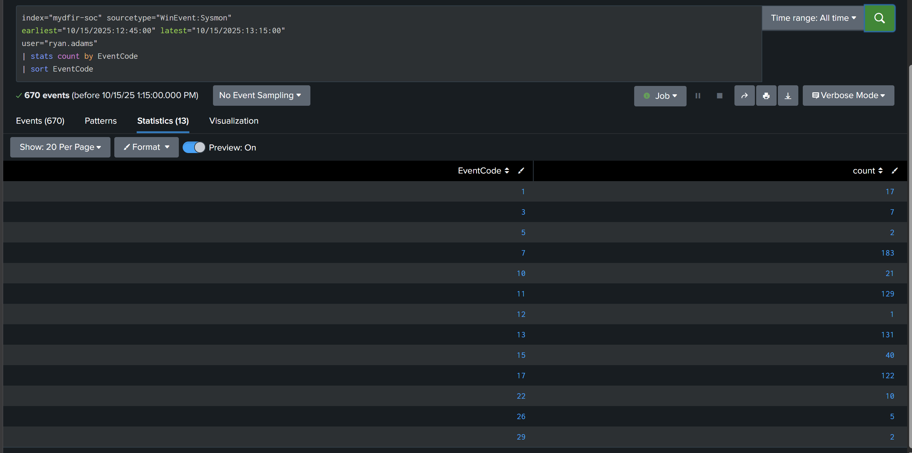

*Figure 7. Sysmon EventCode inventory for Ryan in Window A.*

| Sysmon EventCode | Event type | Investigation question |
|---|---|---|
| 1 | Process creation | What executed, and what launched it? |
| 3 | Network connection | Which process contacted which endpoint? |
| 11 | File creation | Which process wrote the suspicious file? |
| 22 | DNS query | Which name did the process resolve? |

Inspect raw events to verify these meanings and extracted fields. High event volume alone does not determine investigative priority.

<details>
<summary>Additional Sysmon EventCode inventory view from the journey.</summary>

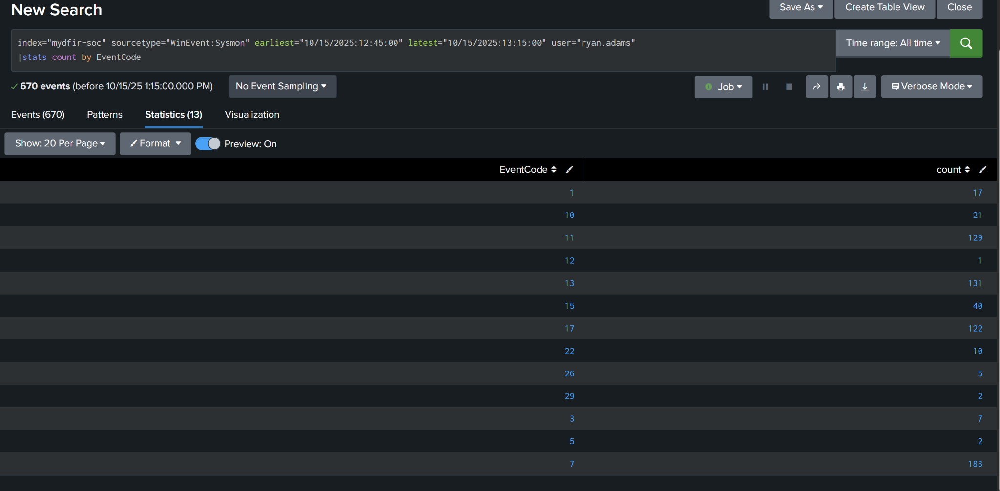

*Figure 8. Additional Sysmon EventCode inventory view from the journey.*

</details>

### 7. Find the suspicious process

**Question:** What executed near the time Ryan noticed mouse movement?

Start with process creation rather than searching for a payload name that has not yet been discovered.

```spl
index="mydfir-soc" sourcetype="WinEvent:Sysmon"
earliest="10/15/2025:12:45:00" latest="10/15/2025:13:15:00"
user="ryan.adams" EventCode=1
| table _time ParentImage Image CommandLine OriginalFileName ProcessId ProcessGuid
| sort 0 _time
```

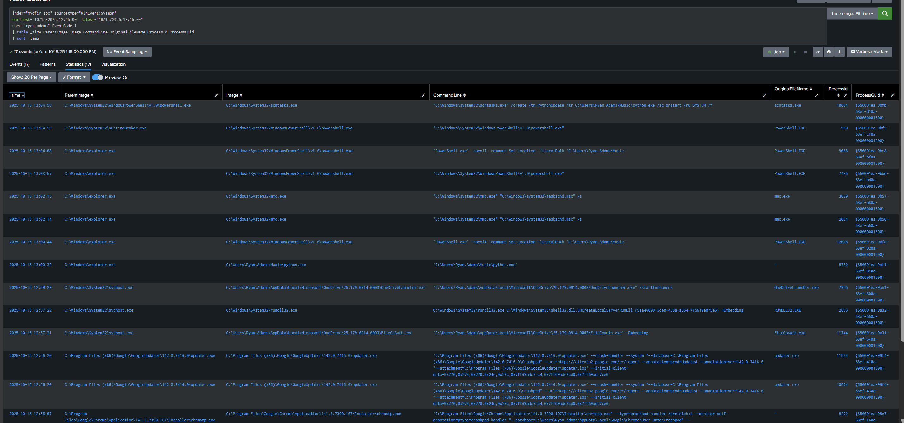

*Figure 9. Broad process-creation results used to discover unusual execution and subsequent task-creation activity.*

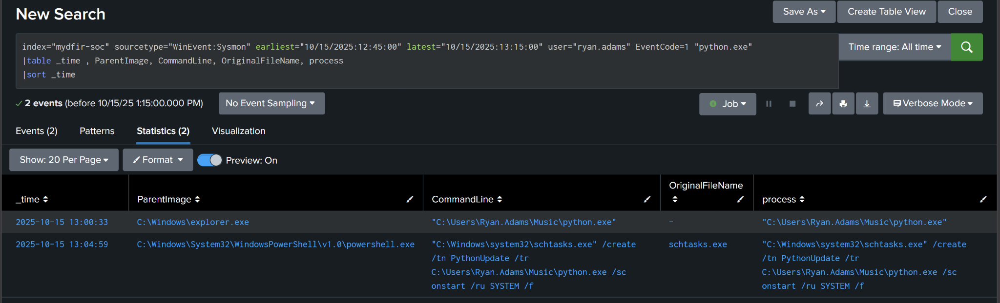

*Figure 10. Focused python.exe search showing its execution and a later schtasks.exe command referencing the same path.*

**Finding:** at **13:00:33**, `C:\Users\Ryan.Adams\Music\python.exe` executed with `C:\Windows\explorer.exe` as its parent.

The filename alone is insufficient: Python is legitimate software. The suspicious combination is the **user's Music directory**, execution timing, subsequent network behavior, and persistence.

Figure 10 also returns `schtasks.exe` because its command line contains `python.exe`. A keyword match does not mean every returned row represents the Python process.

**Next pivot:** use the discovered path to find when the file was written and which process created it.

### 8. Trace the file back to its creation

```spl
index="mydfir-soc" sourcetype="WinEvent:Sysmon"
earliest="10/15/2025:12:45:00" latest="10/15/2025:13:15:00"
user="ryan.adams" EventCode=11
"C:\\Users\\Ryan.Adams\\Music\\python.exe"
| table _time TargetFilename process_name Image ProcessId
| sort 0 _time
```

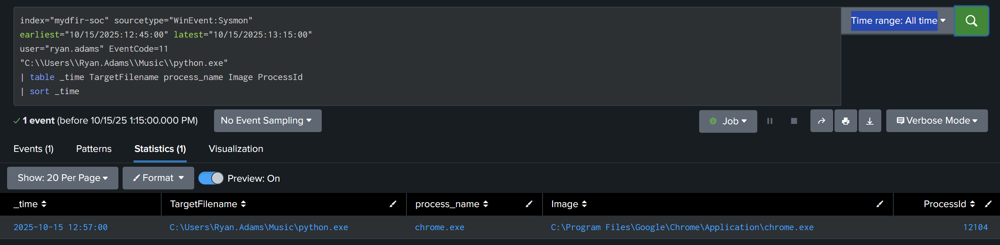

*Figure 11. Targeted file-creation result: chrome.exe wrote Music\python.exe at 12:57:00.*

**Finding:** `chrome.exe` created the suspicious executable at **12:57:00**, before it executed.

**Interpretation:** consistent with a browser download. Event 11 alone does not establish the download URL, whether Ryan intentionally downloaded it, or who caused the browser action.

<details>
<summary>Broad Event 11 search before narrowing to the executable path; this displayed page contains other file activity.</summary>

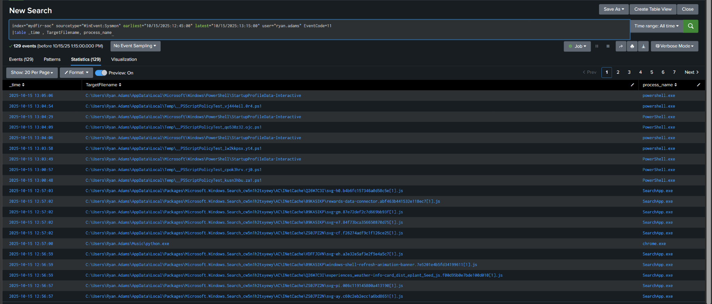

*Figure 12. Broad Event 11 search before narrowing to the executable path; this displayed page contains other file activity.*

</details>

**Next pivot:** inspect network connections from the endpoint, then identify the rows attributed to the suspicious executable.

### 9. Attribute network connections to a process

**Question:** What did the suspicious process contact?

```spl
index="mydfir-soc" sourcetype="WinEvent:Sysmon"
earliest="10/15/2025:12:45:00" latest="10/15/2025:13:15:00"
user="ryan.adams" EventCode=3
| table _time ProcessID DestinationIp DestinationPort SourceIp SourcePort Image
| sort 0 _time
```

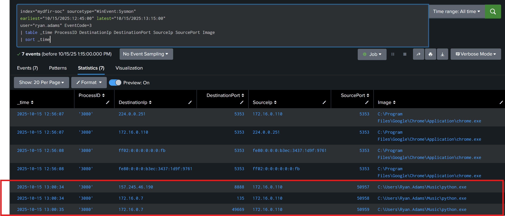

*Figure 13. Sysmon network events: highlighted python.exe connections to an external endpoint and an internal host.*

| UTC | Process image | Destination | Interpretation |
|---|---|---|---|
| 13:00:34 | `Music\python.exe` | `157.245.46.190:8888` | Suspicious external communication; suspected C2 |
| 13:00:34 | `Music\python.exe` | `172.16.0.7:135` | RPC-related internal communication |
| 13:00:35 | `Music\python.exe` | `172.16.0.7:49669` | Additional RPC-related internal communication |

The workstation source IP is `172.16.0.110`. The suspicious rows display **ProcessID 3080** and the executable's full path.

**Correlation caution:** Figure 13 also displays PID 3080 on earlier Chrome rows. Do not join events solely on that number. Use the host, `Image`, timing, and preferably `ProcessGuid` to distinguish process instances. The Chrome mDNS rows on port 5353 are separate activity.

**Evidence boundary:** the process-to-destination attribution is stronger than an IP-only observation. It still does not prove a particular malware family, repeated C2 beaconing, or successful lateral movement.

### 10. Explain the internal destination through DNS

**Question:** Did the process resolve a name associated with `172.16.0.7`?

```spl
index="mydfir-soc" sourcetype="WinEvent:Sysmon"
earliest="10/15/2025:12:45:00" latest="10/15/2025:13:15:00"
user="ryan.adams" EventCode=22 "python.exe"
| table _time ProcessID QueryName QueryResults Image
| sort 0 _time
```

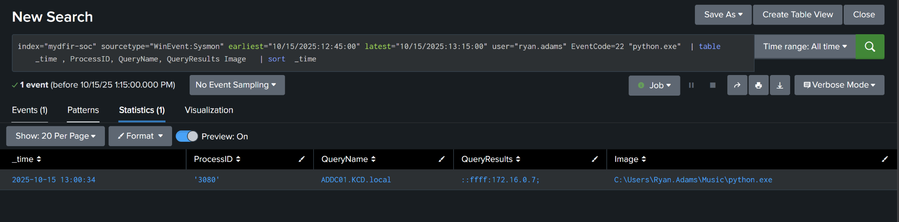

*Figure 14. python.exe DNS query for ADDC01.KCD.local returning ::ffff:172.16.0.7.*

**Finding:** at **13:00:34**, the DNS event displays `ProcessID=3080`, the same suspicious image path, `QueryName=ADDC01.KCD.local`, and `QueryResults=::ffff:172.16.0.7`.

**Interpretation:** the DNS and network records correlate by path, PID, and time. The DNS lookup explains a name-to-address relationship used by the suspicious process. Because the first RPC event is in the same displayed second, these screenshots do not establish sub-second ordering.

**Evidence boundary:** this is a DNS query/resolution event. It is not evidence that DNS records or DNS server settings were modified.

### 11. Check whether ADDC01 has direct evidence of compromise

**Question:** Are these logs from ADDC01, or logs on Ryan's workstation that merely reference it?

```spl
index="mydfir-soc"
earliest="10/15/2025:12:45:00" latest="10/15/2025:13:15:00"
("ADDC01.KCD.local" OR "172.16.0.7")
| table _time sourcetype host EventCode Computer QueryName DestinationIp DestinationPort Image
| sort 0 _time
```

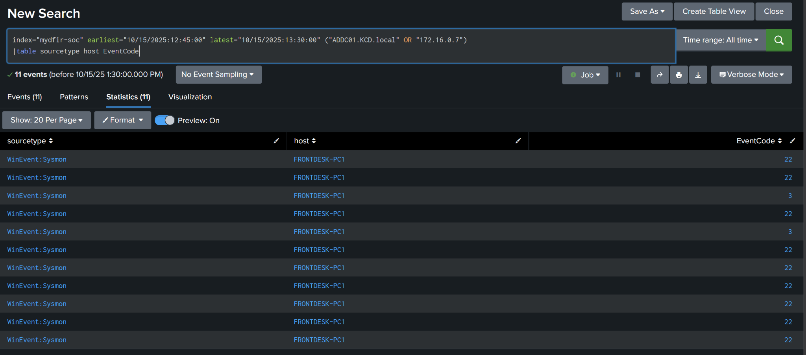

*Figure 15. Original reference search, ending at 13:30, shows FRONTDESK-PC1 Sysmon records referring to ADDC01 or its address.*

**Finding:** the displayed hits are Sysmon Event 22/3 records from `FRONTDESK-PC1`. No direct ADDC01 telemetry was identified in this pivot.

**Evidence boundary:** contact with ADDC01 does not prove its compromise. Obtain direct authentication, service, task, PowerShell, and endpoint telemetry from that host before claiming lateral movement succeeded.

### 12. Corroborate the external connection with Zeek

**Question:** Does an independent network sensor observe communication to the same external endpoint?

```spl
index="mydfir-soc" sourcetype="Zeek"
earliest="10/15/2025:12:45:00" latest="10/15/2025:13:15:00"
id_resp_h="157.245.46.190" id_resp_p=8888
| table _time id_orig_h id_orig_p id_resp_h id_resp_p version cipher established
| sort 0 _time
```

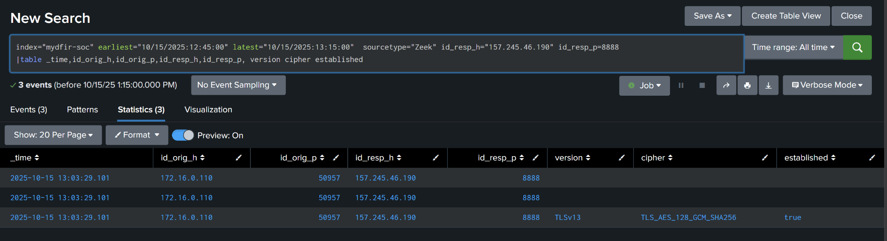

*Figure 16. Zeek corroboration: an established TLSv1.3 session to 157.245.46.190:8888.*

**Finding:** around **13:03:29**, Zeek records `172.16.0.110:50957` communicating with `157.245.46.190:8888`. The TLS row shows `TLSv13`, `TLS_AES_128_GCM_SHA256`, and `established=true`.

**Interpretation:** independently corroborates external communication to the endpoint attributed to `python.exe` by Sysmon. TLS establishment proves a session, not malicious intent by itself.

**Evidence boundary:** Zeek provides network context without process attribution. The timestamps differ from Sysmon; validate full flow timing and connection identifiers before claiming these entries describe the exact same socket/session.

### 13. Preserve the Suricata lead without over-attributing it

**Question:** Does the same external IP appear elsewhere in the incident window?

The query below searches the IP in either direction. The original screenshot uses `src_ip="157.245.46.190"` and therefore shows inbound-direction records.

```spl
index="mydfir-soc" sourcetype="Suricata"
earliest="10/15/2025:12:45:00" latest="10/15/2025:13:15:00"
"157.245.46.190"
| table _time src_ip src_port dest_ip dest_port signature severity
| sort 0 _time
```

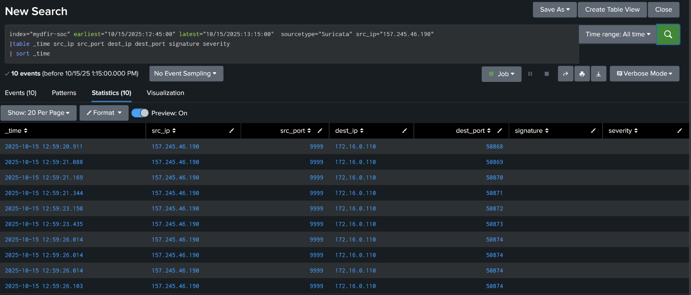

*Figure 17. Suricata traffic from external source port 9999 to the workstation before python.exe execution.*

**Finding:** around **12:59:20–12:59:26**, Suricata records traffic from `157.245.46.190:9999` to `172.16.0.110` on high destination ports, preceding the executable's 13:00:33 launch.

**Evidence boundary:** **9999 is the external source port in these rows**, not a demonstrated listening port on Ryan's host. Direction alone does not establish who initiated a session. There is no process attribution here, and the displayed `signature` and `severity` fields are blank. Retain this as a related investigation lead; do not assert that `python.exe` used port 9999 or that every row is an IDS alert.

### 14. Investigate scheduled-task persistence

**Question:** Is there a mechanism to launch the executable after a reboot?

```spl
index="mydfir-soc" sourcetype="WinEvent:Sysmon"
earliest="10/15/2025:12:45:00" latest="10/15/2025:13:15:00"
EventCode=1 ("PythonUpdate" OR "schtasks.exe")
| table _time CommandLine ParentImage Image
| sort 0 _time
```

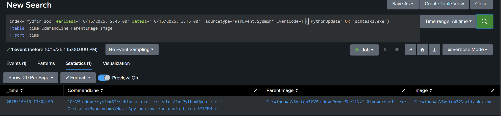

*Figure 18. PowerShell launched schtasks.exe with a PythonUpdate startup task command running the suspicious path as SYSTEM.*

**Finding:** at **13:04:59**, PowerShell launched `schtasks.exe` with the following task-creation parameters:

| Parameter | Observed value | Meaning |
|---|---|---|
| `/create` | Task creation | Create a scheduled task |
| `/tn` | `PythonUpdate` | Task name |
| `/tr` | `C:\Users\Ryan.Adams\Music\python.exe` | Executable to launch |
| `/sc` | `onstart` | Trigger at system startup |
| `/ru` | `SYSTEM` | Requested execution account |
| `/f` | Present | Force task creation/update |

**Assessment:** confirmed persistence behavior in the documented investigation. The displayed Event 1 directly proves execution of the task-creation command and its requested configuration. Task Scheduler registration records or the task definition would independently verify successful registration; these screenshots do not show a later startup execution.

### 15. Review the Defender state change

**Question:** Did a security-relevant Application event occur near the persistence activity?

```spl
index="mydfir-soc" sourcetype="WinEvent:Application"
earliest="10/15/2025:12:45:00" latest="10/15/2025:13:15:00"
| table _time ComputerName Message SourceName EventCode
| sort 0 _time
```

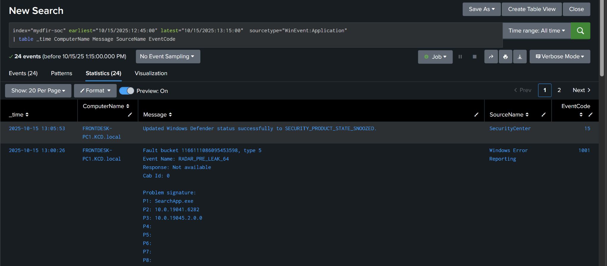

*Figure 19. Windows Security Center reported Defender SNOOZED at 13:05:53; a separate SearchApp error is also visible.*

**Finding:** at **13:05:53**, Security Center reports `Updated Windows Defender status successfully to SECURITY_PRODUCT_STATE_SNOOZED`.

**Interpretation:** a security-relevant state change shortly after the persistence command. The separate `SearchApp.exe` / `RADAR_PRE_LEAK_64` Windows Error Reporting entry is context, not malware evidence by itself.

**Evidence boundary:** timing establishes correlation. This event does not identify the actor or process responsible, so attacker-caused Defender disabling is unconfirmed.

### 16. Check immediate continuation in Window B

**Question:** Do the external IP or exact executable path appear between 13:15 and 14:00?

The window changes intentionally for these two searches.

```spl
index="mydfir-soc"
earliest="10/15/2025:13:15:00" latest="10/15/2025:14:00:00"
"157.245.46.190"
| stats count by sourcetype host
```

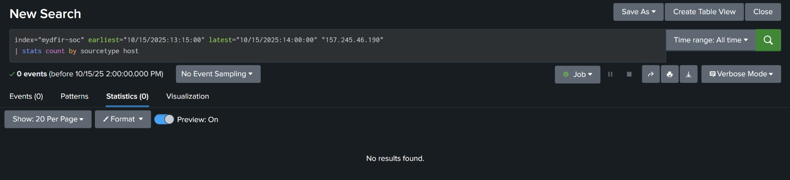

*Figure 20. No matching external-IP telemetry in Window B.*

```spl
index="mydfir-soc"
earliest="10/15/2025:13:15:00" latest="10/15/2025:14:00:00"
"C:\\Users\\Ryan.Adams\\Music\\python.exe"
| table _time sourcetype Computer Image CommandLine DestinationIp DestinationPort
```

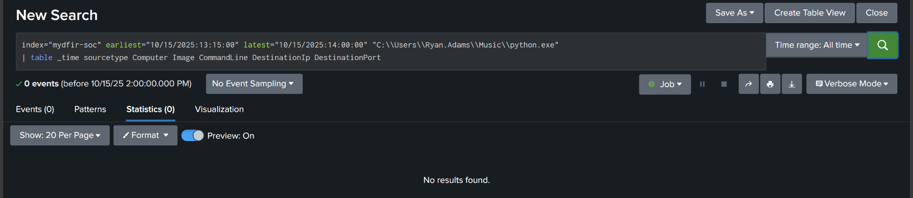

*Figure 21. No matching exact-payload-path telemetry in Window B.*

**Finding:** both supplied searches returned zero events.

**Evidence boundary:** no matching telemetry was observed in this specific window. This is not proof that the host was clean, that all malicious activity stopped, or that startup persistence was removed.

### 17. Scope the artifact across the dataset

**Question:** Does the exact executable path appear on another endpoint?

Select **All time**. This expansion is deliberate.

```spl
index="mydfir-soc" earliest=0
"C:\\Users\\Ryan.Adams\\Music\\python.exe"
| stats count by Computer host sourcetype
```

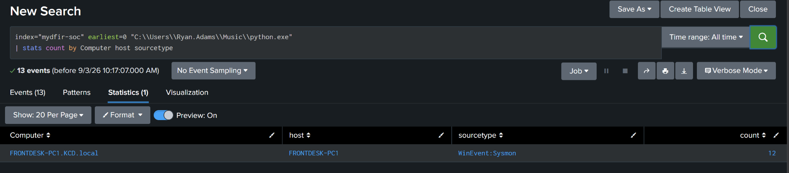

*Figure 22. Exact-path scope displays FRONTDESK-PC1 in the available telemetry.*

**Finding:** the displayed exact-path scope identifies `FRONTDESK-PC1`.

**Evidence boundary:** the path contains Ryan's username, so it can miss the same binary in a different user's directory. The original screenshot also has more raw events than grouped rows account for; inspect ungrouped events and missing fields before treating this aggregation as exhaustive scope.

### 18. Verify a hash and strengthen scope

**Follow-up, not a completed finding:** the source document does not provide an independently verified SHA256. First inspect the executable's endpoint records:

```spl
index="mydfir-soc" sourcetype="WinEvent:Sysmon"
earliest="10/15/2025:12:45:00" latest="10/15/2025:13:15:00"
"C:\\Users\\Ryan.Adams\\Music\\python.exe"
| table _time Image Hashes SHA256 MD5 SHA1
```

Then replace the placeholder below with the **verified hash of the suspicious binary** and search the full dataset:

```spl
index="mydfir-soc" earliest=0 "<VERIFIED_SHA256>"
| stats count by Computer host sourcetype
```

Do not copy another analyst's hash or accidentally use the hash of `schtasks.exe` from a command line that merely references the payload. If the binary hash is absent, record that limitation and obtain it through authorized endpoint/file collection.

## Incident timeline

Times are UTC on **2025-10-15**. This table describes the observed sequence, not proof that every action had the same actor.

| Time | Evidence | Supported conclusion |
|---|---|---|
| 12:52:08 onward | Security 4625; Figures 2, 5 | Repeated failed authentication from `172.16.0.184`; multiple accounts involved |
| 12:52:12 onward | Security 4624 Type 3; Figure 3 | Successful network authentication using Ryan's credentials from the same source |
| 12:55:20 | Security 4624 Type 7; Figure 3 | Separate unlock event |
| 12:57:00 | Sysmon 11; Figure 11 | Chrome created `Music\python.exe` |
| 12:59:20–12:59:26 | Suricata; Figure 17 | External source port 9999 traffic toward the workstation; responsible process unknown |
| 13:00:33 | Sysmon 1; Figures 9–10 | Suspicious executable launched with Explorer as parent |
| 13:00:34 | Sysmon 3; Figure 13 | `python.exe` connected to `157.245.46.190:8888` |
| 13:00:34 | Sysmon 22; Figure 14 | `python.exe` resolved `ADDC01.KCD.local` to `172.16.0.7` |
| 13:00:34–13:00:35 | Sysmon 3; Figure 13 | RPC-related connections to `172.16.0.7:135` and `:49669` |
| 13:03:29 | Zeek; Figure 16 | Established TLS session to the same external IP and port |
| 13:04:59 | Sysmon 1; Figure 18 | `PythonUpdate` startup persistence command executed, requesting SYSTEM |
| 13:05:53 | Application / SecurityCenter; Figure 19 | Defender reported SNOOZED; cause unknown |
| 13:15–14:00 | Follow-up searches; Figures 20–21 | No matching external-IP or exact-path telemetry in this interval |

## Indicators and affected assets

These are **case-specific investigation indicators**. Internal addresses and legitimate tool names are not universal malicious indicators.

| Type | Value | Role / confidence |
|---|---|---|
| Affected account | `Ryan.Adams` | Successful authentication amid a credential attack; unauthorized use suspected |
| Victim hostname | `FRONTDESK-PC1.KCD.local` | Primary affected endpoint |
| Victim IP | `172.16.0.110` | Supported by endpoint and network records |
| Authentication source | `172.16.0.184` | Failed and successful authentication; owner/hostname unknown |
| Suspicious executable | `C:\Users\Ryan.Adams\Music\python.exe` | File creation, execution, network attribution, and persistence target |
| External endpoint | `157.245.46.190:8888` | Suspected C2; process attribution in Sysmon and corroboration in Zeek |
| Supporting network lead | `157.245.46.190:9999` | External source endpoint in Suricata; process unknown |
| Internal destination | `ADDC01.KCD.local` / `172.16.0.7` | DNS and RPC-related target; compromise not established |
| Internal ports | TCP `135`, `49669` | RPC-related communication observed |
| Scheduled task | `PythonUpdate` | Startup persistence command targeting the suspicious executable |
| SHA256 | **Not independently verified** | Hash-based scope remains pending |

## Facts, assessments, and unknowns

| Classification | Finding |
|---|---|
| Fact | Security logs contain repeated failures and successful Type 3 logons from `172.16.0.184` for Ryan. |
| Fact | Chrome created the suspicious file; it executed from the Music folder. |
| Fact | Sysmon attributes external communication and internal DNS/RPC activity to the suspicious image. |
| Fact | PowerShell launched a command to create `PythonUpdate` with an ONSTART trigger and SYSTEM account. |
| Fact | Zeek recorded established TLS communication to `157.245.46.190:8888`. |
| Fact | Security Center reported Defender SNOOZED. |
| Assessment | The combined execution, network, and persistence behavior supports an endpoint compromise assessment. |
| Assessment | The external IP on port 8888 is suspected C2; the multi-account authentication pattern may involve password spraying. |
| Unknown | Identity of the authentication source and whether each observed stage was caused by the same actor. |
| Unknown | Exact download source, verified binary hash, malware family, and any data theft. |
| Unknown | Successful lateral movement, code execution, or compromise on ADDC01. |
| Unknown | Actor responsible for Defender's state change, successful task registration, and subsequent startup execution. |
| Unknown | Activity outside the searched follow-up window or visibility of the available dataset. |

## Final SOC investigation report

### Findings

| Item | Finding |
|---|---|
| Case | Ryan Adams / FRONTDESK-PC1 — Splunk capstone |
| Reported symptom | Unexpected mouse movement around 13:00 UTC on October 15, 2025 |
| Affected user and system | Ryan.Adams; FRONTDESK-PC1.KCD.local / 172.16.0.110 |
| Authentication | Repeated failures and successful network logons from 172.16.0.184; multiple usernames targeted |
| Execution | Chrome-created `Music\python.exe` executed at 13:00:33 |
| External communication | Process-attributed contact with 157.245.46.190:8888; independently corroborated by Zeek |
| Internal activity | DNS resolution of ADDC01 and connections to 172.16.0.7 on RPC-related ports |
| Persistence | PowerShell-launched PythonUpdate startup task-creation command requesting SYSTEM |
| Security-control state | Defender SNOOZED at 13:05:53; cause not established |
| Scope | Exact-path results identify FRONTDESK-PC1; broader hash scope remains pending |
| Immediate follow-up | No matching external-IP or exact-path events during 13:15–14:00 |
| Disposition | Evidence supports an endpoint compromise assessment requiring containment and continued investigation; remediation is not documented as completed |

### Investigation Summary

On October 15, 2025, Windows Security logs recorded repeated failed logons for Ryan.Adams beginning around 12:52:08 UTC from `172.16.0.184` against `FRONTDESK-PC1.KCD.local`. Successful Type 3 network logons using Ryan's credentials followed from the same source. The time-bounded source-IP pivot also shows failed logons involving `administrator`, `andrew.henderson`, and `guest`. The evidence supports a credential attack with possible password-spray behavior; it does not reveal the source's owner or the passwords attempted.

At 12:57:00, Chrome created `C:\Users\Ryan.Adams\Music\python.exe`. At 13:00:33, the executable launched with Explorer as its parent. One second later, Sysmon attributed a connection to `157.245.46.190:8888` to that executable. DNS and network events also show the executable resolving `ADDC01.KCD.local` to `172.16.0.7` and contacting the address on ports 135 and 49669. These observations establish internal communication, but not successful lateral movement or compromise of ADDC01.

Zeek independently recorded an established TLSv1.3 session from the workstation to the same external endpoint around 13:03:29. Together with the endpoint behavior, this supports a suspected C2 assessment. Earlier Suricata records involving external source port 9999 remain a supporting lead because no process attribution is available for that traffic.

At 13:04:59, PowerShell launched `schtasks.exe` with a command to create `PythonUpdate`, configured to launch the suspicious executable at startup as SYSTEM. This demonstrates persistence behavior; successful task registration and later execution should be validated with task-specific evidence. At 13:05:53, Windows Security Center reported Defender entering SNOOZED state. The event's timing is relevant, but its cause is not established.

Follow-up searches returned no matching external-IP or exact-path events between 13:15 and 14:00. Exact-path scoping identified the workstation in the available results. Neither result establishes complete containment or rules out activity on other hosts: hash-based scope, direct ADDC01 telemetry, and later startup activity remain open investigation tasks.

### Who, What, When, Where, Why, How

| Question | Answer |
|---|---|
| **Who?** | Ryan.Adams is the affected user. Authentication originated from 172.16.0.184, whose hostname and owner remain unknown. Attribution to a particular attacker is unsupported. |
| **What?** | Suspicious authentication, execution from the Music folder, suspected C2 communication, internal DNS/RPC activity, and startup persistence behavior. Defender subsequently reported SNOOZED. |
| **When?** | Observed authentication began around 12:52:08 UTC on October 15, 2025. Execution occurred at 13:00:33, the task command at 13:04:59, and the Defender state change at 13:05:53. |
| **Where?** | FRONTDESK-PC1.KCD.local / 172.16.0.110. The executable contacted 157.245.46.190:8888 and ADDC01 / 172.16.0.7 on ports 135 and 49669. |
| **Why?** | Exact motive is unknown. The observed behavior is consistent with obtaining access, maintaining remote access, and establishing persistence. |
| **How?** | Credential failures and successful network logons preceded a Chrome-created executable, Explorer-launched execution, suspicious network activity, and a PowerShell-launched task-creation command. The sequence does not prove a single causal chain or identify the precise initial-access mechanism. |

### Recommendations

These are proposed response actions. The supplied investigation does not document them as completed.

1. **Contain and preserve evidence.** Isolate FRONTDESK-PC1 and preserve relevant memory, disk, event logs, browser artifacts, and task configuration before removing artifacts where operationally feasible.
2. **Secure affected accounts.** Disable or reset compromised credentials as appropriate, invalidate sessions, and review all targeted accounts. Identify the owner of 172.16.0.184 and investigate its time-bounded authentication activity.
3. **Remove persistence and the executable after collection.** Inspect and remove PythonUpdate if registered, quarantine the suspicious file, scan the host, and inspect for other persistence. Verify recovery before reconnecting it.
4. **Verify SHA256 and broaden scope.** Obtain the binary's hash from trustworthy telemetry or the collected file. Search across endpoints for that hash, alternate paths, task names, process lineage, and related network indicators.
5. **Contain suspicious external communication.** Block or monitor 157.245.46.190 according to organizational policy and investigate traffic involving ports 8888 and 9999 across endpoint, network, firewall, and proxy telemetry.
6. **Investigate ADDC01 directly.** Review logons, services, scheduled tasks, PowerShell/WMI/RPC activity, and endpoint events around 13:00. Establish whether remote activity succeeded before expanding confirmed incident scope.
7. **Investigate and restore Defender protection.** Review Defender/EDR events, policy changes, exclusions, and tamper-protection status to explain SNOOZED and confirm protections are active.
8. **Resolve initial access.** Review Chrome and network artifacts around 12:56–12:57 to identify the actual download source. Do not assume the suspected C2 IP also hosted the download.
9. **Improve detection and prevention.** Monitor authentication failures followed by successes, multi-account attempts from one source, startup tasks pointing to user-writable directories, and unusual executable/network combinations. Apply suitable MFA and account-lockout controls.
10. **Validate the recovery period.** Review later telemetry and startup behavior, verify task removal, and monitor for recurring indicators before closing the incident.

### Report Limitations

- The evidence consists of the supplied investigation document and screenshots, not a fresh examination of the raw events or endpoint.
- Successful authentication does not independently identify the person using the credentials, prove RDP access, or connect every later action to that session.
- The exact download URL, binary hash, and malware family remain unverified.
- No direct ADDC01 telemetry was identified by the supplied pivot. Successful lateral movement and data exfiltration are not established.
- PID values alone are insufficient for reliable process-instance attribution; the screenshot set warrants checking raw `ProcessGuid` values.
- A task-creation command does not itself show a registration result or later task execution. Preserve the documented persistence assessment while validating those details.
- Defender SNOOZED is correlated in time; attacker causation is unproven.
- Wider-window screenshots and grouped searches have stated limits. Zero matches and an exact-path scope are not proof that the entire environment is clear.

## Reusable investigation workflow

1. Define the scenario and an explicit incident window.
2. Inventory sources and discover event types.
3. Correlate authentication failures and successes by account, source, destination, and logon type.
4. Find suspicious execution, then trace the artifact back to its creation.
5. Attribute network and DNS activity to the process using stable identifiers where available.
6. Corroborate with independent network telemetry.
7. Inspect persistence and security-control changes.
8. Check continuation and broaden scope using verified indicators.
9. Build a UTC timeline, separate facts from assessments and unknowns, and write the SOC report.

**Core lesson:** know the question, identify the right telemetry, verify the event type, and let the evidence determine the conclusion.

### Skills demonstrated

SPL search development, Windows authentication analysis, Sysmon process/file/DNS/network correlation, Zeek and Suricata corroboration, scheduled-task investigation, incident scoping, and clear SOC reporting.

### Evidence files

Original DOCX screenshots are stored in [`screenshots/docx/`](screenshots/docx/). This README contains the revised walkthrough, copyable searches, and final report together. The older root-level PDF and query file are prior companion artifacts and were not regenerated for this revision.
